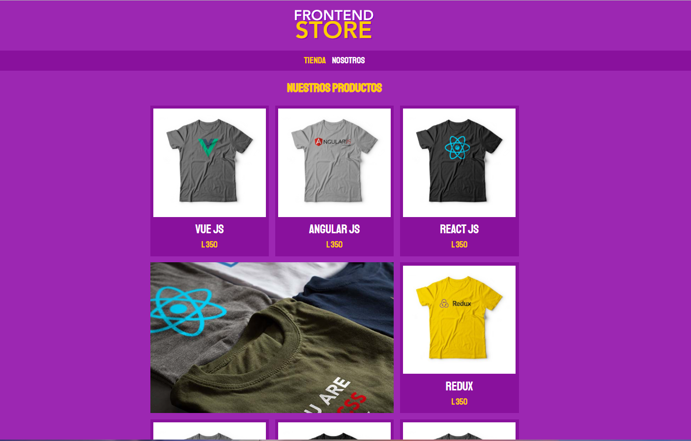

# frontend-store
Este proyecto es una tienda de camisetas que muestra iconos representativos de las tecnologías utilizadas en el desarrollo de frontend web. El HTML y el CSS de este proyecto siguen buenas prácticas y el estándar BEM (Block Element Modifier) para una estructura de código organizada y mantenible.

## Características

- Muestra una variedad de camisetas con iconos de tecnologías populares.
- Utiliza el estándar BEM para la nomenclatura de clases CSS.
- Diseño responsive para una experiencia de usuario óptima en dispositivos móviles y de escritorio.
- Código HTML y CSS bien estructurado y comentado.
- Fácil de personalizar y ampliar con nuevas camisetas e iconos.

## Captura de Pantalla de Inicio

## Autor

- Este proyecto fue desarrollado por [yulyus-qaysar](github.com/yulyus-qaysar).

